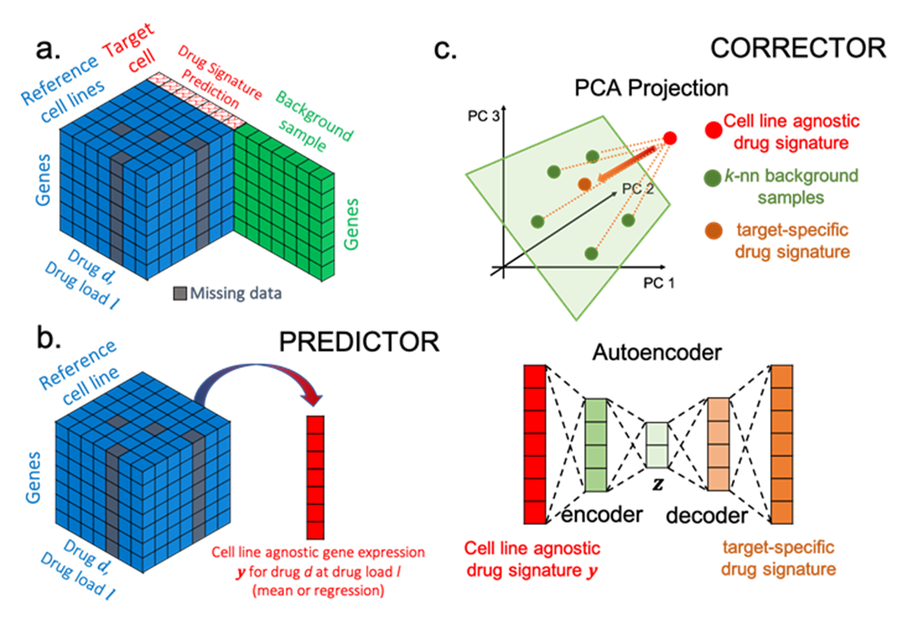

# CrossTx: Cross-cell line Transcriptomic Signature Predictions

  

CrossTx is a tool for predicting transcriptional response of an unseen target cell line
to a treatment using reference transcriptome data from reference cell lines for
the same treatment and background transcriptome data of the target cells. Background
 data refer to unlabeled transcriptome for the target cells that are available
 from the literature or public databases or past experiments.
 
 Please refer to the publication below for details:
 
 P. Chrysinas, C. Chen, R. Gunawan. CrossTx: Cross-cell line Transcriptomic Signature Prediction, bioRxiv, 523287, 2023. 
 
 Link: https://www.biorxiv.org/content/10.1101/2023.01.09.523287v1
